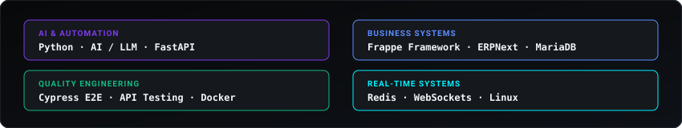

  <!-- Refined Hero Visual -->
  

   

  

    
    &nbsp;&nbsp;&nbsp;
    
    &nbsp;&nbsp;&nbsp;
    
  

 

<!-- 01 / SELECTED WORK -->

  <code>01 / SELECTED WORK</code>

<table width="100%" style="border-collapse: collapse; border: none;">
  <tr>
    <td width="50%" valign="top" style="border: none; padding: 8px 12px;">
      
    </td>
    <td width="50%" valign="top" style="border: none; padding: 8px 12px;">
      
    </td>
  </tr>
  <tr>
    <td width="50%" valign="top" style="border: none; padding: 8px 12px;">
      
    </td>
    <td width="50%" valign="top" style="border: none; padding: 8px 12px;">
      
    </td>
  </tr>
</table>

 

<!-- 02 / CURRENTLY BUILDING -->

  <code>02 / CURRENTLY BUILDING</code>

  

 

<!-- 03 / TECHNOLOGIES & CAPABILITIES -->

  <code>03 / TECHNOLOGIES &amp; CAPABILITIES</code>

  

 

<!-- 04 / ACTIVITY -->

  <code>04 / ACTIVITY</code>

  

 

<!-- Minimal Quiet Footer -->

  
<b>JENCY M &bull; SOFTWARE ENGINEER</b>

  
BUILD &bull; TEST &bull; AUTOMATE &bull; SHIP

  

    <a href="https://github.com/jencym634-sudo">GitHub</a> &bull;
    <a href="https://linkedin.com/in/jency-m-31291735a">LinkedIn</a> &bull;
    <a href="mailto:jencym634@gmail.com">Email</a>
  

