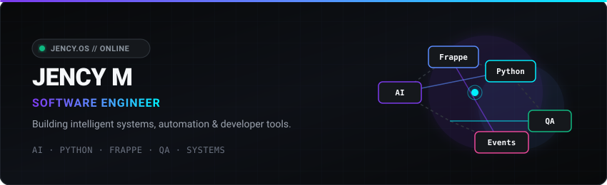
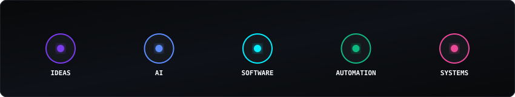

<div align="center">

  <!-- Custom Hero Visual -->
  

  <br/>

  <p align="center">
    <a href="https://github.com/jencym634-sudo">
      
    </a>
    &nbsp;&nbsp;
    <a href="https://linkedin.com/in/jency-m-31291735a">
      
    </a>
    &nbsp;&nbsp;
    <a href="mailto:jencym634@gmail.com">
      
    </a>
  </p>

</div>

---

## SELECTED WORK

<table width="100%" style="border-collapse: collapse; border: none;">
  <tr>
    <td width="50%" valign="top" style="border: none; padding: 10px;">
      <a href="https://github.com/jencym634-sudo">
        
      </a>
      <p><b>01 &bull; AI APP FACTORY</b><br/>
      Natural language &rarr; Frappe applications<br/>
      <code>Python &bull; Frappe &bull; AI</code></p>
    </td>
    <td width="50%" valign="top" style="border: none; padding: 10px;">
      <a href="https://github.com/jencym634-sudo">
        
      </a>
      <p><b>02 &bull; ERP HEALTH MONITOR</b><br/>
      Real-time ERP infrastructure monitoring<br/>
      <code>Frappe &bull; Redis &bull; WebSockets</code></p>
    </td>
  </tr>
  <tr>
    <td width="50%" valign="top" style="border: none; padding: 10px;">
      <a href="https://github.com/jencym634-sudo">
        
      </a>
      <p><b>03 &bull; LIVE CLASSROOM OBSERVER</b><br/>
      Real-time attendance &amp; engagement<br/>
      <code>FastAPI &bull; Redis &bull; WebSockets</code></p>
    </td>
    <td width="50%" valign="top" style="border: none; padding: 10px;">
      <a href="https://github.com/jencym634-sudo">
        
      </a>
      <p><b>04 &bull; AI CAPTION STUDIO</b><br/>
      Speech &rarr; translation &rarr; subtitles<br/>
      <code>FastAPI &bull; Whisper &bull; FFmpeg</code></p>
    </td>
  </tr>
</table>

---

## CURRENTLY BUILDING

### **AI APP FACTORY** &nbsp; <code>&bull; ACTIVE</code>

```text
IDEA  ──►  AI  ──►  APPLICATION  ──►  VERIFY  ──►  SHIP
```

---

## CAPABILITIES

<table width="100%" style="border-collapse: collapse; border: none;">
  <tr>
    <td width="50%" valign="top" style="border: none; padding: 8px;">
      <p><b>AI SYSTEMS</b><br/>
      LLM applications &bull; Automation</p>
    </td>
    <td width="50%" valign="top" style="border: none; padding: 8px;">
      <p><b>BUSINESS SYSTEMS</b><br/>
      Frappe &bull; ERPNext</p>
    </td>
  </tr>
  <tr>
    <td width="50%" valign="top" style="border: none; padding: 8px;">
      <p><b>QUALITY ENGINEERING</b><br/>
      Cypress &bull; API / E2E</p>
    </td>
    <td width="50%" valign="top" style="border: none; padding: 8px;">
      <p><b>REAL-TIME SYSTEMS</b><br/>
      Redis &bull; WebSockets</p>
    </td>
  </tr>
</table>

---

<!-- Signature Visual -->
<p align="center">
  
</p>

---

## TECH STACK

```text
CORE            : Python • JavaScript • SQL
APPLICATIONS    : Frappe • ERPNext • FastAPI • React
INFRASTRUCTURE  : Redis • MariaDB • Docker • Linux
AI & TESTING    : AI / LLM • Cypress • WebSockets
```

---

## ACTIVITY

<div align="center">
  
</div>

<br/>

<div align="center">
  
</div>

---

<div align="center">
  <p><b>JENCY M</b> &bull; <sub>BUILD &bull; TEST &bull; AUTOMATE &bull; SHIP</sub></p>
  <p>
    <a href="https://github.com/jencym634-sudo">GitHub</a> &bull;
    <a href="https://linkedin.com/in/jency-m-31291735a">LinkedIn</a> &bull;
    <a href="mailto:jencym634@gmail.com">Email</a>
  </p>
</div>
