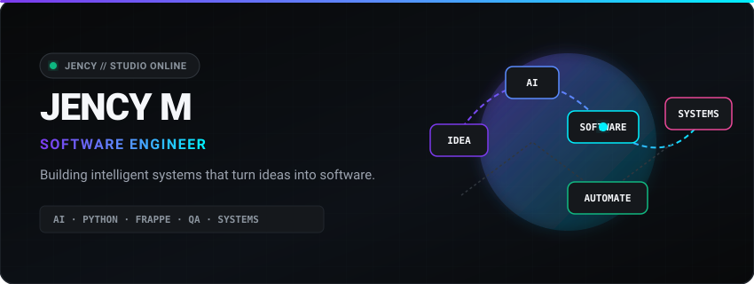
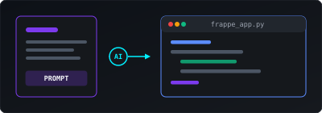
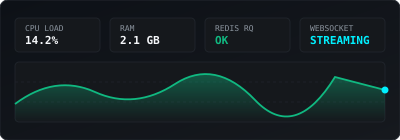
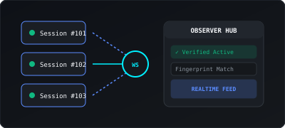
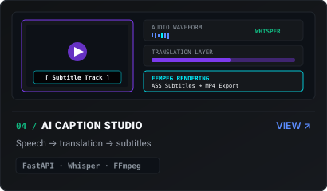
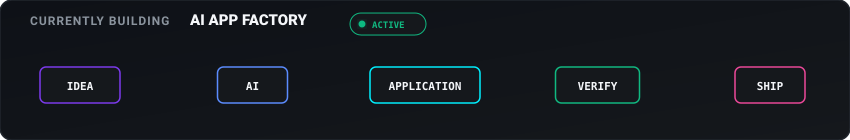

  <!-- Hero Header Visual -->
  

    

  

    
    &nbsp;&nbsp;&nbsp;
    
    &nbsp;&nbsp;&nbsp;
    
  

 

<!-- 01 / SELECTED WORK -->

  <code>01 / SELECTED WORK</code>

<table width="100%" style="border-collapse: separate; border-spacing: 12px; border: none;">
  <tr>
    <td width="50%" valign="top" style="background: #111315; border: 1px solid #21262D; border-radius: 10px; padding: 14px;">
      
        
      <h3 style="margin: 0; color: #F5F7FA; font-size: 15px;">01 / AI APP FACTORY</h3>
      
Natural language &rarr; Frappe applications

      <code>Python</code> &bull; <code>Frappe</code> &bull; <code>AI</code>
    </td>
    <td width="50%" valign="top" style="background: #111315; border: 1px solid #21262D; border-radius: 10px; padding: 14px;">
      
        
      <h3 style="margin: 0; color: #F5F7FA; font-size: 15px;">02 / ERP HEALTH MONITOR</h3>
      
Real-time ERP infrastructure monitoring

      <code>Frappe</code> &bull; <code>Redis</code> &bull; <code>WebSockets</code>
    </td>
  </tr>
  <tr>
    <td width="50%" valign="top" style="background: #111315; border: 1px solid #21262D; border-radius: 10px; padding: 14px;">
      
        
      <h3 style="margin: 0; color: #F5F7FA; font-size: 15px;">03 / LIVE CLASSROOM OBSERVER</h3>
      
Real-time attendance &amp; engagement

      <code>FastAPI</code> &bull; <code>Redis</code> &bull; <code>WebSockets</code>
    </td>
    <td width="50%" valign="top" style="background: #111315; border: 1px solid #21262D; border-radius: 10px; padding: 14px;">
      
        
      <h3 style="margin: 0; color: #F5F7FA; font-size: 15px;">04 / AI CAPTION STUDIO</h3>
      
Speech &rarr; translation &rarr; subtitles

      <code>FastAPI</code> &bull; <code>Whisper</code> &bull; <code>FFmpeg</code>
    </td>
  </tr>
</table>

 

<!-- 02 / CURRENTLY BUILDING -->

  <code>02 / CURRENTLY BUILDING</code>

  

 

<!-- 03 / TECHNOLOGIES & CAPABILITIES -->

  <code>03 / TECHNOLOGIES &amp; CAPABILITIES</code>

<table width="100%" style="border-collapse: separate; border-spacing: 12px; border: none;">
  <tr>
    <td width="50%" valign="top" style="background: #111315; border: 1px solid #7C3AED; border-radius: 8px; padding: 14px;">
      <h4 style="margin: 0 0 8px 0; color: #7C3AED; font-size: 12px; letter-spacing: 0.5px;">AI &amp; AUTOMATION</h4>
      <code>Python</code> &bull; <code>AI / LLM</code> &bull; <code>FastAPI</code>
    </td>
    <td width="50%" valign="top" style="background: #111315; border: 1px solid #5B8CFF; border-radius: 8px; padding: 14px;">
      <h4 style="margin: 0 0 8px 0; color: #5B8CFF; font-size: 12px; letter-spacing: 0.5px;">BUSINESS SYSTEMS</h4>
      <code>Frappe Framework</code> &bull; <code>ERPNext</code> &bull; <code>MariaDB</code>
    </td>
  </tr>
  <tr>
    <td width="50%" valign="top" style="background: #111315; border: 1px solid #10B981; border-radius: 8px; padding: 14px;">
      <h4 style="margin: 0 0 8px 0; color: #10B981; font-size: 12px; letter-spacing: 0.5px;">QUALITY ENGINEERING</h4>
      <code>Cypress E2E</code> &bull; <code>API Testing</code> &bull; <code>Docker</code>
    </td>
    <td width="50%" valign="top" style="background: #111315; border: 1px solid #00F0FF; border-radius: 8px; padding: 14px;">
      <h4 style="margin: 0 0 8px 0; color: #00F0FF; font-size: 12px; letter-spacing: 0.5px;">REAL-TIME SYSTEMS</h4>
      <code>Redis</code> &bull; <code>WebSockets</code> &bull; <code>Linux</code>
    </td>
  </tr>
</table>

 

<!-- 04 / ACTIVITY -->

  <code>04 / ACTIVITY</code>

  

 

<!-- Minimal Quiet Footer -->

  
<b>JENCY M &bull; SOFTWARE ENGINEER</b>

  
BUILD &bull; TEST &bull; AUTOMATE &bull; SHIP

  

    <a href="https://github.com/jencym634-sudo">GitHub</a> &bull;
    <a href="https://linkedin.com/in/jency-m-31291735a">LinkedIn</a> &bull;
    <a href="mailto:jencym634@gmail.com">Email</a>
  

