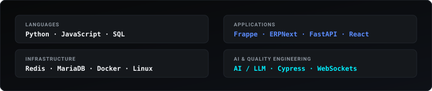

  <!-- Studio Hero Visual -->
  

   

  

    
    &nbsp;&nbsp;&nbsp;
    
    &nbsp;&nbsp;&nbsp;
    
  

---

## SELECTED WORK

<table width="100%" style="border-collapse: collapse; border: none;">
  <tr>
    <td width="50%" valign="top" style="border: none; padding: 12px;">
      
      
<b>01 &bull; AI APP FACTORY</b> 
      Natural language &rarr; Frappe applications 
      <code>Python &bull; Frappe &bull; AI</code>

    </td>
    <td width="50%" valign="top" style="border: none; padding: 12px;">
      
      
<b>02 &bull; ERP HEALTH MONITOR</b> 
      Real-time ERP infrastructure monitoring 
      <code>Frappe &bull; Redis &bull; WebSockets</code>

    </td>
  </tr>
  <tr>
    <td width="50%" valign="top" style="border: none; padding: 12px;">
      
      
<b>03 &bull; LIVE CLASSROOM OBSERVER</b> 
      Real-time attendance &amp; engagement 
      <code>FastAPI &bull; Redis &bull; WebSockets</code>

    </td>
    <td width="50%" valign="top" style="border: none; padding: 12px;">
      
      
<b>04 &bull; AI CAPTION STUDIO</b> 
      Speech &rarr; translation &rarr; subtitles 
      <code>FastAPI &bull; Whisper &bull; FFmpeg</code>

    </td>
  </tr>
</table>

---

<!-- Currently Building Visual -->

  

---

## CAPABILITIES

<table width="100%" style="border-collapse: collapse; border: none;">
  <tr>
    <td width="50%" valign="top" style="border: none; padding: 10px;">
      
<b>AI SYSTEMS</b> 
      LLM applications

    </td>
    <td width="50%" valign="top" style="border: none; padding: 10px;">
      
<b>BUSINESS SYSTEMS</b> 
      Frappe / ERPNext

    </td>
  </tr>
  <tr>
    <td width="50%" valign="top" style="border: none; padding: 10px;">
      
<b>QUALITY ENGINEERING</b> 
      Cypress / API / E2E

    </td>
    <td width="50%" valign="top" style="border: none; padding: 10px;">
      
<b>REAL-TIME SYSTEMS</b> 
      Redis / WebSockets

    </td>
  </tr>
</table>

---

## TECHNOLOGIES

  

---

## ACTIVITY

  

 

  

---

  
<b>JENCY M &bull; DIGITAL ENGINEERING STUDIO</b>

  
BUILD &bull; TEST &bull; AUTOMATE &bull; SHIP

  

    <a href="https://github.com/jencym634-sudo">GitHub</a> &bull;
    <a href="https://linkedin.com/in/jency-m-31291735a">LinkedIn</a> &bull;
    <a href="mailto:jencym634@gmail.com">Email</a>
  

